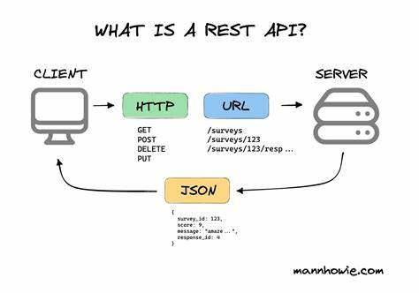

# CRUD Operations

CRUD is not an English word but an acronym for Create, Read, Update, and Delete. These operations allow users to manipulate and interact with data from the application. 

## HTTP Methods

Create - post

Read - get (id)

Update - put & patch (id)
 
Delete - delete (id)

#### difference between put & patch
##### PATCH: Submits a partial modification to a resource. If you only need to update one field for the resource, you may want to use the PATCH method.
-------------------------------------------------------------------------------------------------------
## Project
In this project we will use [mockapi](https://mockapi.io/) for creating fake API. 
###### API consists of base url and endpoint.
## REST API
